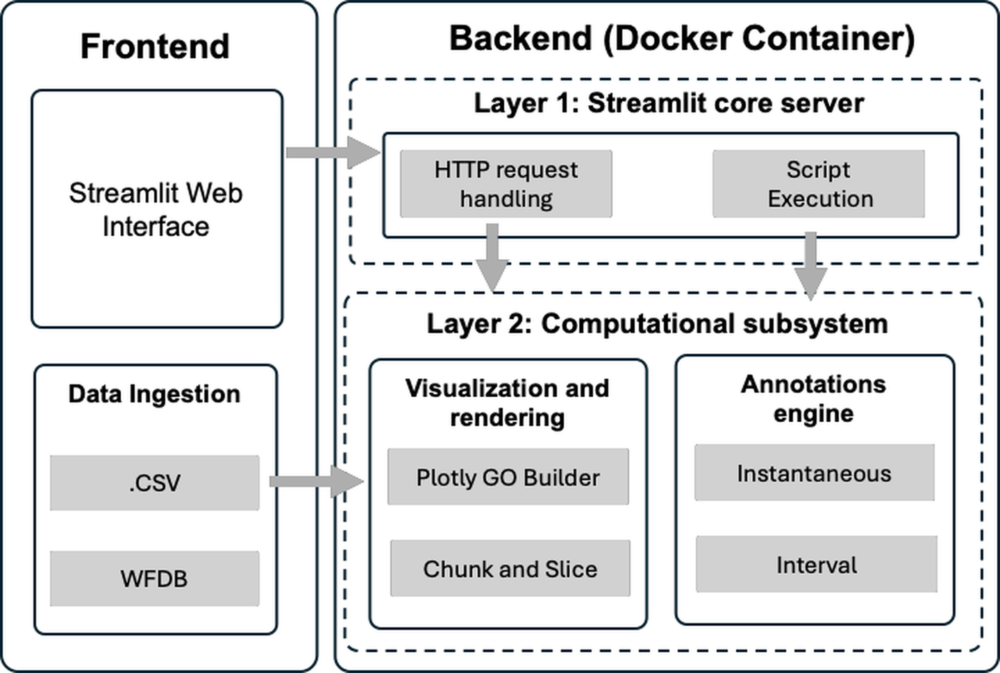
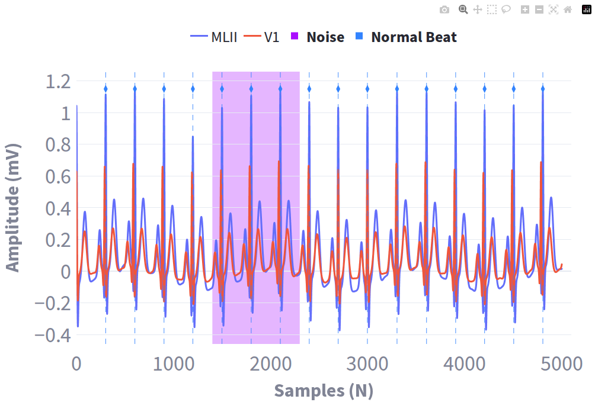
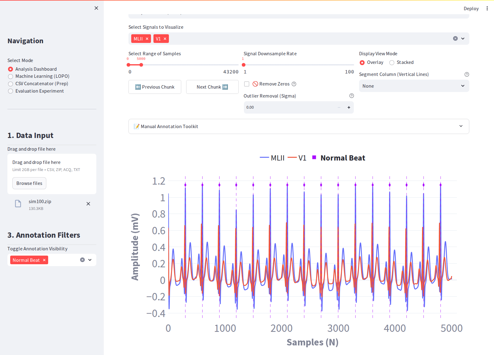

# BioViz Studio

**An open-source, containerized framework for scalable visualization and hybrid annotation of psycho-physiological time-series signals.**

[](LICENSE.txt)
[](https://doi.org/10.5281/zenodo.18636308)

BioViz Studio is a browser-based tool for inspecting and labelling long physiological recordings (ECG, accelerometer, gyroscope, heart rate and other biosignals) and turning expert annotations into machine-learning-ready datasets. It runs as a single Docker container, so the same pinned environment behaves identically on a laptop, a workstation or an HPC node.



---

## Contents

- [Key features](#key-features)
- [Installation](#installation)
- [Quick start](#quick-start)
- [Using BioViz Studio](#using-bioviz-studio)
- [Supported input formats](#supported-input-formats)
- [Outputs](#outputs)
- [Optional: Cloud Firestore logging](#optional-cloud-firestore-logging)
- [Reproducing the paper's benchmarks](#reproducing-the-papers-benchmarks)
- [Repository structure](#repository-structure)
- [Citation](#citation)
- [License](#license)
- [Support](#support)

---

## Key features

- **Hybrid annotation engine.** Mark *instantaneous* fiducial points (e.g. P, Q, R, S, T peaks), drawn as dashed vertical lines, and *interval* events (e.g. noise segments, arrhythmia episodes, activity bouts), drawn as semi-transparent bands, on the same recording.
- **Runtime label schemas.** Upload a plain-text, comma-separated list of event labels to extend the label set for your study protocol without changing any code.
- **Native WFDB annotations.** Beat and rhythm annotations stored in PhysioNet `.atr` files are loaded and displayed automatically.
- **Chunk-and-Slice rendering.** View a window of the recording (5,000 samples by default), step through it chunk by chunk, and down-sample when needed; traces are drawn with WebGL (`Scattergl`) so multi-million-sample recordings stay responsive. A safety valve warns when a window would exceed 5,000 points per signal and suggests a down-sampling rate.
- **Privacy by default.** Recordings are processed only in the current session and never uploaded; a notice at the top of the dashboard states this.
- **ML-ready export.** Download your annotations, or a merged dataset in which every sample carries its event label, type and notes (overlapping labels are combined).
- **Built-in ECG analysis.** NeuroKit2 signal cleaning and R-peak detection on the selected window.
- **Machine learning module.** Leave-one-participant-out (LOPO) evaluation of Random Forest, SVM, Decision Tree and Gradient Boosting classifiers on a feature table.
- **Benchmark mode.** Measures load latency, figure-construction latency and throughput over a folder of recordings; this is the mode used for the evaluation in the paper.
- **Reproducible deployment.** Python 3.10, pinned dependencies and a single `docker compose` command.



*Simulated two-lead ECG (NeuroKit2) showing native "Normal Beat" annotations (dashed lines, diamond markers) and a manually added "Noise" interval (shaded band).*

---

## Installation

### Option A — Docker (recommended)

Requires [Docker Desktop](https://www.docker.com/products/docker-desktop/) (macOS, Windows) or Docker Engine with the Compose plugin (Linux).

```bash
git clone https://github.com/wearablebiosensing/multimodal_biosignalviz_SoftwareX.git
cd multimodal_biosignalviz_SoftwareX
docker compose up --build
```

Open **http://localhost:8501** in your browser. Stop the app with `Ctrl+C`, or `docker compose down`.

> **macOS note:** allocate at least 4 GB of memory to Docker (*Settings → Resources*) for large recordings.

The compose file runs the container with elevated privileges and an unconfined seccomp profile to lift Docker's default thread limits for large files. If your environment does not allow this, remove the `privileged` and `security_opt` entries from `docker-compose.yml`; the app still runs.

### Option B — Local Python environment

Requires Python 3.10.

```bash
cd src
python3.10 -m venv .venv
source .venv/bin/activate          # Windows: .venv\Scripts\activate
pip install -r requirements.txt
streamlit run biosignal_viz.py
```

---

## Quick start

1. Download a PhysioNet record, for example from the MIT-BIH Noise Stress Test Database:

   ```bash
   pip install wfdb
   python eval_scripts/download_physionet.py nstdb
   ```

2. Zip the three files of one record (e.g. `118e06.hea`, `118e06.dat`, `118e06.atr`) into `118e06.zip`.
3. In the app, choose **Analysis Dashboard** and drop the ZIP into **1. Data Input**. The signal is plotted and the reference beat annotations appear.
4. Open **Manual Annotation Toolkit**, optionally upload `examples/custom_labels_example.txt`, pick a label and type, and click **Add Manual Event**.
5. Tick **Prepare Merged Dataset for ML Training** and download the merged CSV.



---

## Using BioViz Studio

Choose a mode in the sidebar.

### Analysis Dashboard

| Control | What it does |
|---|---|
| **Select X-Axis** | Plot against the sample index or any column (e.g. a timestamp). |
| **Select Signals to Visualize** | One or more channels to draw. |
| **Select Range of Samples** + **Previous / Next Chunk** | The Chunk-and-Slice window. |
| **Signal Downsample Rate** | Draw every *n*-th sample (1–100). A warning suggests a rate when the window exceeds 5,000 points per signal. |
| **Remove Zeros / Outlier Removal (Sigma)** | Display-only cleaning; the underlying data is unchanged. |
| **Display View Mode** | *Overlay* on one axis, or *Stacked* subplots. |
| **Segment Column** | Draws labelled boundaries from a categorical column (e.g. an activity code). |
| **Annotation Filters** (sidebar) | Show or hide annotations by label. |
| **Advanced ECG Analysis** | R-peak detection on the current window. |

**Manual Annotation Toolkit**

- **Load Custom Event Labels:** a `.txt` file of comma-separated labels, e.g.
  `Normal Sinus, Signal Loss, Baseline Wander, Motion Artifact`. Custom labels are added to the base taxonomy:
  - *Interval:* Normal Sinus, Noise, Motion Artifact, Baseline Wander, Signal Loss, Arrhythmia, Stress Event, P-wave, R-wave, T-wave
  - *Instantaneous:* P-wave, Q-wave, R-wave, S-wave, T-wave, Other
- **Event Type:** *Interval* (start and end) or *Instantaneous* (single point).
- **Start / End Point:** in samples when the x-axis is the sample index, otherwise in seconds.
- **Clinical/Research Notes:** free text stored with the annotation.
- The table lists the current annotations; entries can be selected and deleted.

### Machine Learning (LOPO)

Upload a feature table (CSV) with a `participantId` column and a binary `BehaviorCode` column (0/1). Choose a model (Random Forest, Support Vector Machine, Decision Tree, Gradient Boosting) and an undersampling method (`Rus`, `Clus`, `None`), then run. Fold-level results (CSV) and summary metrics (JSON) can be downloaded.

### Evaluation Experiment

Benchmarks rendering performance over a folder of WFDB records and/or CSV files (enter a local path or upload files). Set the number of trials, channels and an optional point limit, run, and download the results CSV. See [Reproducing the paper's benchmarks](#reproducing-the-papers-benchmarks).

### CSV Concatenator (Prep)

Placeholder for a preprocessing utility; not yet implemented in this release.

---

## Supported input formats

| Format | Extension | Notes |
|---|---|---|
| Comma-separated values | `.csv` | One column per channel; any column can serve as the x-axis. |
| Delimited text | `.txt` | Delimiter detected automatically. |
| BIOPAC AcqKnowledge | `.acq` | Read with `bioread`; sampling rate taken from the file. |
| PhysioNet WFDB | `.zip` containing `.hea` + `.dat` (+ optional `.atr`) | Sampling rate from the header. `.atr` symbols are mapped to readable labels: `N` Normal Beat, `V` PVC, `A` APC, `L` LBBB, `R` RBBB, `+` Rhythm Change, `~` Artifact; other symbols appear as `Beat_<symbol>`. |

The default upload limit in the Docker deployment is 2 GB per file.

---

## Outputs

| File | Contents |
|---|---|
| `annotations_<session>.csv` | One row per manual annotation: `id`, `label`, `type`, `start_time`, `end_time` (seconds), `sample_idx`, `notes`. |
| `merged_<session>.csv` | The original data plus `event_label`, `event_type` and `event_notes` columns. Samples covered by several annotations list all of them separated by `; `. |
| `<model>_LOPO_results.csv`, `<model>_LOPO_summary.json` | Fold-level and summary metrics from the ML module. |
| `benchmark_<session>.csv` | Per-trial `execution_time_ms`, `plot_gen_time_ms`, `throughput_ksps`, `peak_memory_mb` (peak resident memory of the app process), `total_points_rendered`, `active_trace_count`. |

---

## Optional: Cloud Firestore logging

By default BioViz Studio runs entirely locally: annotations are kept for the browser session and benchmark results are computed in memory. No recordings, annotations or metrics leave your machine.

To persist annotations across sessions and log performance telemetry to your own Google Cloud Firestore project:

1. Create a Firebase service-account key and save it as `src/firebase_key.json` (this path is git-ignored and excluded from the Docker image).
2. Start the app with the Firebase override, which mounts the key read-only at runtime:

   ```bash
   docker compose -f docker-compose.yml -f docker-compose.firebase.yml up --build
   ```

With Firestore enabled, session metadata, annotations (including notes) and performance metrics are written to the `analysis_logs` collection. Uploaded signal files are never uploaded. `src/firestore_export.py` exports the logged collections to CSV.

> **Never commit service-account keys.** If a key is ever pushed to a repository, revoke it in the Google Cloud console immediately.

---

## Reproducing the paper's benchmarks

The evaluation uses two open PhysioNet databases and a wearable behavioral dataset:

- MIT-BIH Noise Stress Test Database (`nstdb`)
- MIT-BIH Long-Term ECG Database (`ltdb`)
- Wearable Acc/Gyr/HR dataset described in Sadhu et al., *Proc. 15th Int. Conf. on the Internet of Things*, 2025 (doi:10.1145/3770501.3770523)

Step-by-step instructions, a download script and the analysis notebook are in [`eval_scripts/`](eval_scripts/README.md).

---

## Repository structure

```text
multimodal_biosignalviz_SoftwareX/
├── src/                          # Application source (Docker build context)
│   ├── biosignal_viz.py          # Streamlit app: dashboard, ML, benchmark modes
│   ├── processing_helpers.py     # ECG processing, annotation storage, dataset merging
│   ├── firebase_module.py        # Optional Firestore logging (no-op without a key)
│   ├── firestore_export.py       # Export logged Firestore data to CSV
│   ├── machine_learning/         # LOPO classifiers (RF, SVM, DT, GB)
│   ├── requirements.txt          # Pinned Python dependencies
│   └── Dockerfile
├── eval_scripts/                 # Benchmark reproduction (notebook, data download, Jupyter container)
├── examples/                     # Sample custom-label schema
├── docs/images/                  # Figures used in this README
├── docker-compose.yml            # One-command deployment
├── docker-compose.firebase.yml   # Optional Firestore override
├── CITATION.cff
└── LICENSE.txt
```

---

## Citation

If you use BioViz Studio, please cite the software (see [`CITATION.cff`](CITATION.cff)) and the accompanying SoftwareX article once published.

```bibtex
@software{bioviz_studio,
  title   = {BioViz Studio: An open-source containerized framework for scalable visualization
             and hybrid annotation of psycho-physiological time-series signals},
  author  = {{Wearable Biosensing Lab, University of Rhode Island}},
  version = {1.0.1},
  doi     = {10.5281/zenodo.18636308},
  url     = {https://github.com/wearablebiosensing/multimodal_biosignalviz_SoftwareX},
  year    = {2026}
}
```

## License

Released under the [MIT License](LICENSE.txt).

## Support

Please report bugs and ask questions through [GitHub Issues](https://github.com/wearablebiosensing/multimodal_biosignalviz_SoftwareX/issues).

Wearable Biosensing Lab, University of Rhode Island.
